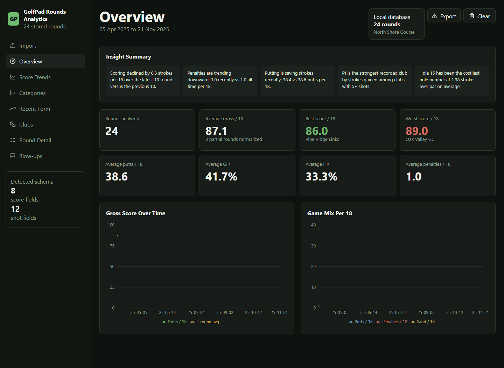

# GolfPad Rounds Analytics

GolfPad Rounds Analytics is a local-first dashboard for exploring round history exported from Golf Pad. Upload the official Golf Pad ZIP export, then optionally import official Min Golf handicap history to evaluate each round against the handicap you had when it was played.



## What it does

- Imports the official Golf Pad ZIP export without sending the file to a server.
- Detects `Rounds.csv`, `Holes.csv`, and `Shots.csv` inside the archive.
- Imports the official Min Golf handicap/round history workbook after at least one Golf Pad round exists.
- Parses official handicap values over time and stores them alongside manual handicap entries.
- Matches Min Golf handicap records to Golf Pad rounds by date, nearby date, gross score, and course text where available.
- Adds `round_handicap_context` to stored rounds so historical analytics use round-time handicap instead of only the current value.
- Shows overview KPIs, score trends, handicap-aware trends, category trends, recent form, club analytics, round detail, and blow-up analysis.
- Shows a year-filterable handicap trend graph, smoothed trend line, monthly handicap movement, and end-of-season forecast.
- Forecasts season-end handicap with a blend of official handicap slope and recent Golf Pad scoring versus handicap expectation.
- Stores normalized data in a persistent Docker volume when run with Docker.
- Falls back to browser localStorage when running as a static/development frontend without the persistence API.
- Skips duplicate rounds on repeated imports.
- Lets you export or clear the local browser database.

## Simple usage

1. Export your data from Golf Pad as a ZIP file.
2. Open this website locally.
3. Go to `Import`.
4. Upload or drag the Golf Pad ZIP file into the import panel.
5. Upload the Min Golf handicap history workbook if you want official handicap context.
6. Review the dashboard tabs once the imports finish.

The Golf Pad ZIP and Min Golf workbook are parsed in your browser. After import, the original file references are cleared and only normalized dashboard data is saved.

The Min Golf import is disabled until at least one Golf Pad round has been imported. The dashboard shows this message when there are no rounds:

```text
Import at least one Golf Pad round before importing handicap history so rounds can be matched.
```

## Run locally

Install dependencies:

```bash
npm install
```

Start the development server:

```bash
npm run dev
```

Open the local URL printed by Vite, usually:

```text
http://localhost:5173
```

Build the production bundle:

```bash
npm run build
```

Preview the production build:

```bash
npm run preview
```

## Run with Docker

Build and start the container:

```bash
docker compose up --build
```

Then open:

```text
http://localhost:36490
```

Docker stores the database in the named volume `golfpad-data`, mounted at `/data` in the container. The app writes the database to `/data/rounds.json`, so parsed rounds, handicap history, and round handicap context survive container rebuilds, image updates, and restarts.

Update the container without deleting stored rounds:

```bash
docker compose up --build -d
```

Do not run `docker compose down -v` unless you intentionally want to delete the persistent database volume.

## Data and privacy

Golf Pad export files are parsed in the browser with `JSZip` and `Papa Parse`; the original ZIP is not uploaded or stored by the backend. Min Golf handicap workbooks are parsed in the browser with the existing `JSZip` dependency by reading the workbook XML. When run with Docker, imported rounds, handicap history, and round handicap context are saved as normalized JSON in `/data/rounds.json` inside the persistent `golfpad-data` volume. When run with the Vite development server only, the app falls back to the browser localStorage key `golfpad.analytics.rounds.v1`.

Use the dashboard `Export` action to download the normalized JSON database, or `Clear` to remove all stored rounds while preserving handicap history.

## Expected Golf Pad export files

The importer looks for CSV files in the ZIP by name:

- `Rounds.csv` is required.
- `Holes.csv` is optional, but enables hole-level analysis.
- `Shots.csv` is optional, but enables club and shot analytics.

If `Holes.csv` or `Shots.csv` are missing, the app still imports round summaries, but some dashboard sections will have limited data.

## Expected Min Golf export file

The implemented importer was built from the real sample `min_handicap_ronder.xlsx`. Detected structure:

- File type: `.xlsx` workbook.
- Sheet: `Resultat`.
- Columns:
  - `Nr.`
  - `Speldatum`
  - `Starttid`
  - `Klubb`
  - `Bana`
  - `Land`
  - `Tävlingsnamn`
  - `Antal spelade hål`
  - `Par`
  - `Tee`
  - `Typ`
  - `CR`
  - `SL`
  - `Markörnamn`
  - `Justerad bruttoscore`
  - `Spel-HCP`
  - `Poäng`
  - `PCC`
  - `Justerat HCP-resultat`
  - `Ny exakt hcp`
  - `Rond ingår i HCP-beräkning`
  - `Extraordinär score (ack.)`
  - `Manuell justering (ack.)`

The official handicap history is represented by `Ny exakt hcp` for each dated row. The importer also keeps `Justerat HCP-resultat`, `PCC`, `Justerad bruttoscore`, played holes, par, tee, course rating, slope, points, and whether the round was included in handicap calculation when those fields are present.

Round dates and scores are included through `Speldatum`, `Starttid`, `Klubb`, `Bana`, `Justerad bruttoscore`, `Spel-HCP`, `Poäng`, and `Justerat HCP-resultat`. Matching against Golf Pad rounds uses same-date matches first, then nearby-date/course matches. Gross score is compared with Min Golf adjusted gross when both values exist.

## Handicap analytics

Manual handicap entries and imported Min Golf entries are stored in one local handicap history. Duplicate same-date manual entries are superseded by official Min Golf values, while distinct historical official records are preserved.

Each stored Golf Pad round is annotated with `round_handicap_context`:

- `handicap_at_round`
- `handicap_source`
- `nearest_official_record_date`
- `nearest_official_handicap`
- `matched_official_record_id`
- `match_confidence`
- `match_notes`

Round detail, blow-up analysis, and performance-versus-handicap metrics use `handicap_at_round` when available. This keeps old rounds from being judged against only the latest handicap.

The Handicap tab includes:

- Year selector with `All Time` plus imported years.
- Official handicap graph and smoothed trend line.
- Starting handicap, latest handicap, total movement, and monthly movement for the selected period.
- End-of-season forecast with projected, optimistic, conservative, and confidence-band values.
- Momentum insights that compare official handicap movement with recent Golf Pad scoring trends.

## Tech stack

- React
- TypeScript
- Vite
- Recharts
- JSZip
- Papa Parse
- Docker optional runtime

## Project structure

```text
src/
  analytics.ts                 Round normalization and dashboard metrics
  golfpadParser.ts             ZIP and CSV parsing
  minGolfParser.ts             Min Golf XLSX/CSV handicap import parser
  handicap.ts                  Handicap history, round context, trend, and forecast logic
  storage.ts                   Persistent API client with localStorage fallback
  main.tsx                     App shell and dashboard views
  components/                  Import, chart, KPI, club, handicap, and round detail UI
server.mjs                     Static file server and persistent JSON database API
docs/
  dashboard.png                README dashboard screenshot
```
